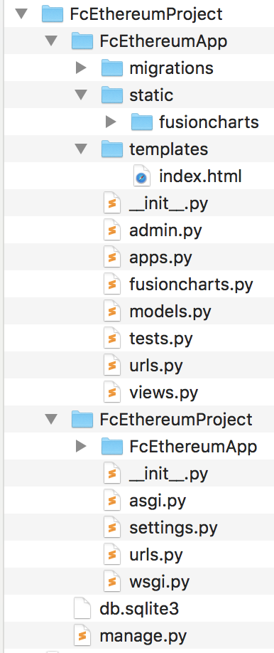

# Creating Historical Ethereum Charts Using Django/Python 

After completing step 1 to 4, you have the following directory structure:



## Step 1: Create Project
### Step 1.1: Create a Django project
Create a Django project 

```
django-admin startproject FcEthereumProject
cd FcEthereumProject
```

### Step 1.2: Create the App

```
python manage.py startapp FcEthereumApp
```

## Step 2: Add FusionCharts Components

Download fusioncharts-suite-xt from [FusionCharts Download Page](https://www.fusioncharts.com/download/fusioncharts-suite-xt?framework=django)

### Step 2.1: Add fusioncharts.py
Locate the fusioncharts.py from the Integrations/django/fusioncharts-wrapper folder and paste it in FcEthereumApp folder

### Step 2.2: Add static/fusioncharts Folder
Create a static/fusioncharts folder in FcEthereumApp folder and copy all the files from the downloaded fusioncharts-suite-xt/js to this folder

### Step 2.3: Create index.html File
Create a templates folder in FcEthereumApp and place the index.html file there. It has the import sections for FusionCharts library and contains the div tag for the chart-container

## Step 3: Adjust Project Settings

### Step 3.1: Update the settings.py File

Open the FcEthereumProject/settings.py file and add the name of the django app, i.e., 'FcEthereumApp' in the 'INSTALLED_APPS'

Add the following to the template section of settings.py file:

```
'DIRS': ['FcEthereumProject/FcEthereumApp/templates'],
```

Create a new variable STATIC_ROOT in the same settings.py file. The variable holds the path of the static folder:

```
STATIC_ROOT = "FcEthereumProject/FcEthereumApp/static"
```

### Step 3.2: Collect static Files
At the console type:

```
python manage.py collectstatic
```

## Step 4: Add the URLs

### Step 4.1: In Apps Folder
In the FcEthereumApp folder create a file urls.py file

### Step 4.2 In the Project folder 
In the FcEthereumProject there is already a urls.py file. Modify it and add the path for the FcEthereumApp.urls

```
path('', include('FcEthereumApp.urls'))
```


## Step 5: Create the Chart
Open views.py file and add the code for calling coinlayer API and creating the FusionCharts there

## View the Chart
At the console type:

```
python manage.py runserver
```
You can view the chart in your browser at:  http://127.0.0.1:8000/
